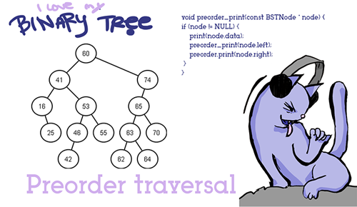

# Binary Trees - DFS Notes

This includes

* In-Order
* Pre-Order
* Post Order

I will be drawing off of a PSD file and doing a screencast.
I highly suggest you sketch stuff out on paper as well.

# Additional Materials

* [highly excellent video with visuals](https://www.youtube.com/watch?v=gm8DUJJhmY4)
* See [pdf/](pdf/) for notes from a college level lecture class. 

## Tips

* __Tip__ If you're inclined to learning from print, I highly recommend finding a used college-level textbook (the thicker the better) as they tend to discuss the basics in more depths than an ebook or blog post
* MEMORIZE IT BY HEART - it's not intuitive
* This stuff is easy but it's fairly boring to learn. Think of it like learning multiplication scales. You will get to do more interesting algorithms later
* You will rarely encounter this stuff in your everyday job, so it's all the more important to find special ways to memorize this. Dip it in candy / chocolate / any non illegal substance